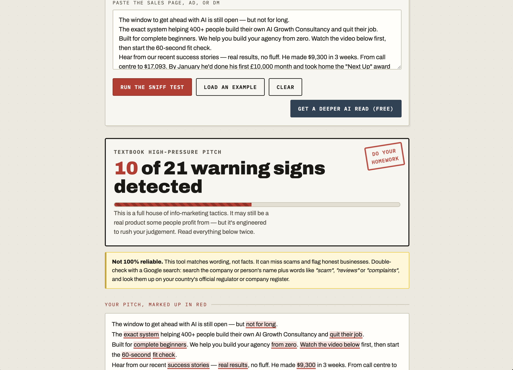

# The Sniff Test

A small browser tool that helps you read a "make money online" pitch — an AI-agency course, a trading bot, a dropshipping programme, a coaching DM — and spot the persuasion tactics **before** you hand over any money.

Paste in the text of a sales page or ad, and the app marks up the manipulative phrases in red, explains what each one is doing to you, shows the reality behind the income claims, and gives you the questions to ask before you pay.

> **Why it exists:** these offers hide their price until a high-pressure call, show you only their best-ever results, and lean on urgency to stop you thinking. This tool puts the thinking back.

---

## Live demo

**[Try it here](https://the-jasper-foundation.github.io/Sniff-Test/)**

## Screenshot



---

## Features

- **Pattern detection** — scans pasted text for 21 warning signs: 12 high-pressure sales tactics (hidden pricing, urgency, survivorship-bias testimonials, lifestyle bait, and more) plus 9 "quiet" scam signals that often appear in calm, professional language (guaranteed returns, crypto/gift-card payments, fees to withdraw your money, secrecy, moving to WhatsApp/Telegram, unverified "fully regulated" claims, recruitment schemes, and requests for passwords or ID).
- **High-risk override** — any classic scam marker (e.g. "pay a release fee to withdraw") sets the verdict to "Serious scam warning signs", however few other flags fire.
- **Free AI second opinion** — the "Get a deeper AI read (free)" button copies a ready-made prompt (your text + analysis instructions) to your clipboard, with links to open ChatGPT, Claude or Gemini. The app itself never sends your text anywhere; you choose whether to paste it into an AI.
- **Honest about its limits** — every result says it's not 100% reliable and tells you to double-check with a Google search and the official regulator.
- **Red-pen markup** — highlights the exact phrases in your own pasted text.
- **Plain-English explanations** — for every tactic found, what it is and what to do about it.
- **Reality check** — always shows the maths these pitches skip (revenue vs profit, survivorship bias, one peak month ≠ a salary).
- **Questions to ask** — a checklist to use before paying for anything.

## How to run it locally

No build step, no dependencies. Either:

1. **Easiest:** download the files and double-click `index.html` — it opens in your browser.
2. **Or** open the folder in your editor and use a live-preview extension.

That's it. It's a static site (HTML + CSS + JavaScript).

## Deploy a free live version (GitHub Pages)

1. Push this folder to a public GitHub repository.
2. On GitHub: **Settings → Pages**.
3. Under **Build and deployment → Source**, choose **Deploy from a branch**.
4. Pick the `main` branch and the `/ (root)` folder, then **Save**.
5. Wait a minute, then your live link appears at the top of the Pages settings. Paste it into the "Live demo" section above.

## Privacy & security

This app is designed to be safe to publish and safe to use:

- **Nothing is collected or sent.** All analysis happens in your browser. The text you paste never leaves your device — there is no server, no database, no analytics, no tracking. (The AI button only copies a prompt to your clipboard; your text reaches an AI service only if you paste it there yourself.)
- **No accounts, no cookies, no local storage.** Close the tab and the data is gone.
- **No secrets in the code.** There are no API keys or credentials anywhere in this repository, and `.gitignore` is set up to keep environment/secret files out if you add any later.
- **Strict Content-Security-Policy.** `index.html` includes a CSP that blocks every resource except this app's own files and Google Fonts — so even if text were malicious, it can't load or run anything external.
- **Pasted text is HTML-escaped** before being shown, preventing cross-site-scripting (XSS) from anything you paste in.

> Optional hardening: the only third-party request is to Google Fonts. To make the app fully self-contained (zero external requests), download the fonts and serve them from this folder instead of the Google CDN.

## How it works (in short)

`app.js` holds a list of tactics, each with a regular expression. When you run a check, it scans your text, records where each tactic matches, merges overlapping matches, and rebuilds your text with the matched spans wrapped in highlights. The number of distinct tactics found drives the verdict and the meter. The explanatory sections are always shown.

## Tech

Plain **HTML, CSS, and vanilla JavaScript**. No frameworks, no build tools.

```
index.html   → structure (and the security policy)
styles.css   → all styling
app.js       → the analyzer logic
```

## Roadmap

- **v2:** swap the keyword rules for a real LLM call so it can reason about *novel* pitches, not just known phrases.
- Self-hosted fonts for zero external requests.
- A way to share a result as a link.

## License

MIT — free to use, modify, and share. See [`LICENSE`](LICENSE).

## Author

Built by **The_Jasper** — [https://the-jasper-foundation.github.io/Sniff-Test/].

_This tool flags persuasion patterns to encourage critical thinking. A flag is not proof that any company is dishonest or unlawful. Always do your own research._
